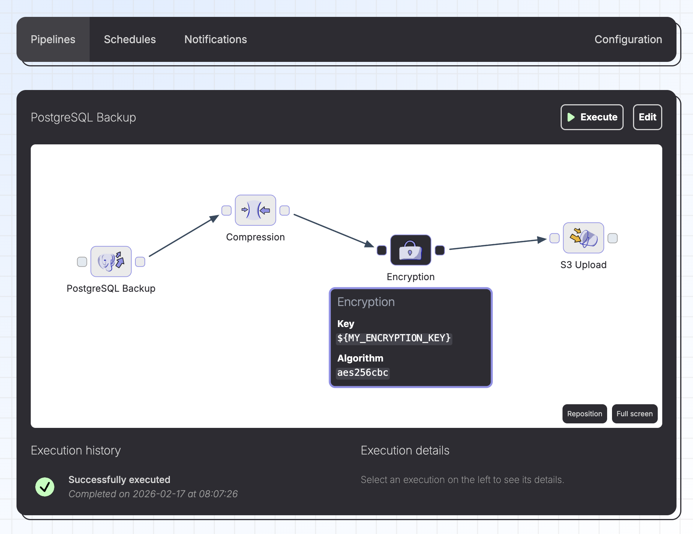

# Brespi: A Visual Backup-n-Restore Pipeline Builder



## Summary

Brespi makes it easy to define, execute and schedule backup and restore pipelines. Think: a visual pipeline builder which allows you to chain together various steps, like:

* PostgreSQL Backup
* MariaDB Backup
* S3 Download
* S3 Upload

and many others.

## Quickstart

```sh
# Clone the source code
git clone git@github.com:butterhosting/brespi.git

# Create a docker image with the desired runtime dependencies
./brespi.sh image create --postgresql --mariadb

# Run the container
docker run --rm -p 3000:3000 brespi:latest
```

## Documentation

Please visit https://brespi.butterhost.ing for detailed documentation.
